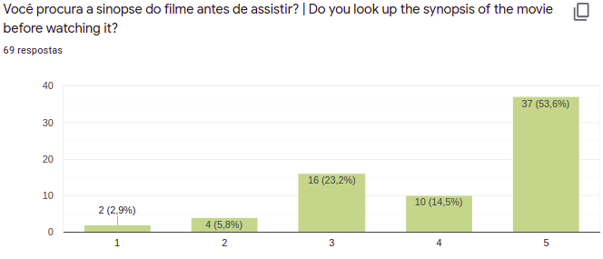
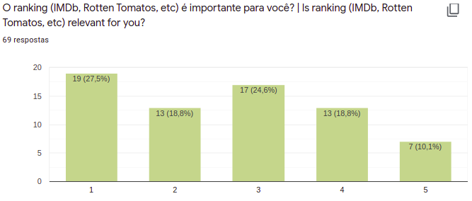
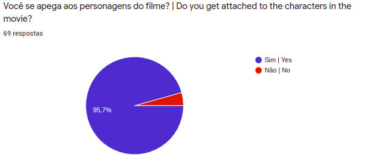
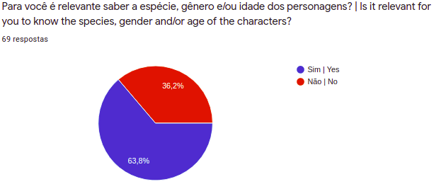
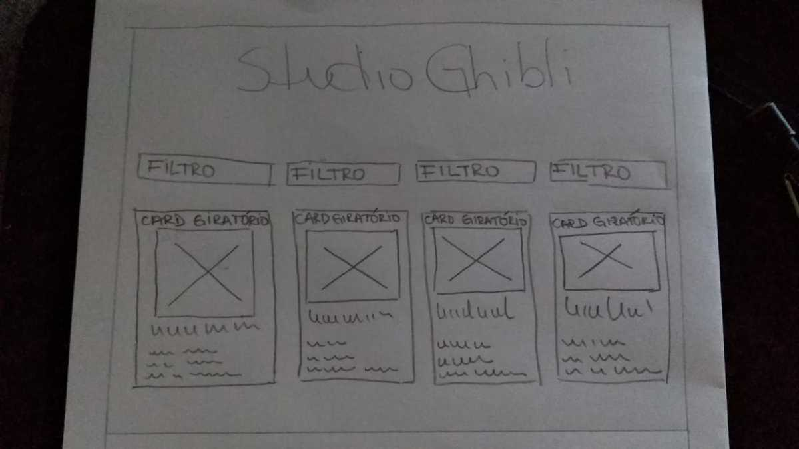
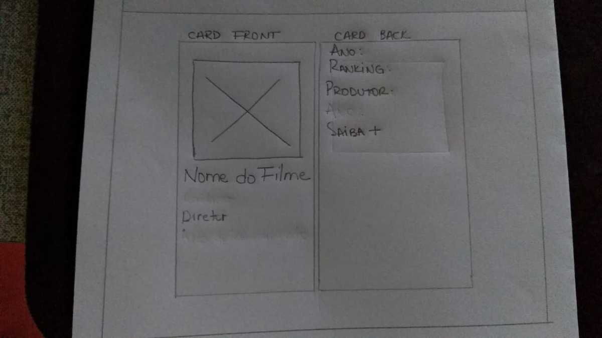

# STUDIO GHIBLI CAT

This Studio Ghibli Catalog was developed by me, Leths Oliveira and my study partner, [Letícia Aniceto](https://github.com/leticia-aniceto) as part of the second project of the Bootcamp of [Laboratoria Brazil](https://www.laboratoria.la/br) Class 06!

The project challenge was to create a web page containing info about Studio Ghibli (which thematic was choosen by us) working with a data base and filtering all the information into something easier to the user to sort it.

So get ready to start a great adventure into de Ghibli World and to know better all the process behind the scenes of making a great Catalog for their fans.

## PRODUCT DEFINITION

Known worldwide for its films, Studio Ghibli is a Japanese animation studio founded in 1985 by Hayao Miyazaki, Isao Takahata, Toshio Suzuki and Yasuyoshi Tokuma and has produced 21 films to date.

His success is international, making his films to be translated into several languages ​​and getting several international nominations and awards.

Thinking about this entire repertoire as a film production studio and as fans of it, we decided to create a
A website with information from Studio Ghibli that displays a list of films released between 1984 and 2014 containing all the characteristics of the films and characters.

The user can choose to filter movies by year of release, by director, movie name (if you want to see a specific movie), sort alphabetically and even the type of terrain where each movie takes place. 

In the case of characters, it can filter by gender, species, character name and sort the characters alphabetically.

## SURVEYS

Thinking about the best way to attend this request, we conducted research to better understand Studio fans and make a nice website for everyone.

And here are some results.

Always consider that 5 is the most relevant grade and 1 the least relevant grade and 69 people answered that form:

- 43,5% do not find relevant to research about the director/producer of the films they watch.  

   
  

- 68,1% do look up the synopsis of the movie before watching it.  

   
  

- 46,3% find ranking (IMDb, Rotten Tomatos, etc) relevant.  

   
  

- 95,7% get attached to the characters in the movies.  

   
  

- 63,8% find relevant to know the species, gender and/or age of the characters.  

   
  

There is also other research made available by the project that indicates that:

- Studio Ghibli has several animations and for the users it is important to know how many and which ones they are.
- The minds behind each animation are the directors and producers, and they may have contributed to the creation on more than one work.
- Therefore, it is important for the user to be able to meet them and know how many and which creations they have worked on.
- Animations have relevant information for the users, such as description, release date, director, producer and characters.
- Each animation has its characters and for our users it is important to know how many and which ones they are.
- Characters have unique characteristics that the user wants to know, such as name, age, gender, species, etc.
- The animations have unique locations in each one and for the users it is important to know which ones they are.
- In addition to this information, it is important that the users are able to see the species types in each animation.

Bringing these two surveys together and looking up to fullfil all kinds of users, we got to the following point:

## USERS STORIES

## DESIGN

Finally we started working on how this Catalog would looks like.

This is our first low fidelity prototype hand drawn.

   
  

Got to say, I know I'm not the best at hand drawing. :laughing:

And bellow is how our cards should look in the front and then, flipping to the info in the back.

   
  

Then, hands on coding!
Attending to our users stories, we got to the multi-page high fidelity prototype:

   
  

With a page only for characters.

   
  

GREAT! Now, we just need to make some users tests to see how it goes..

## USABILITY TESTS